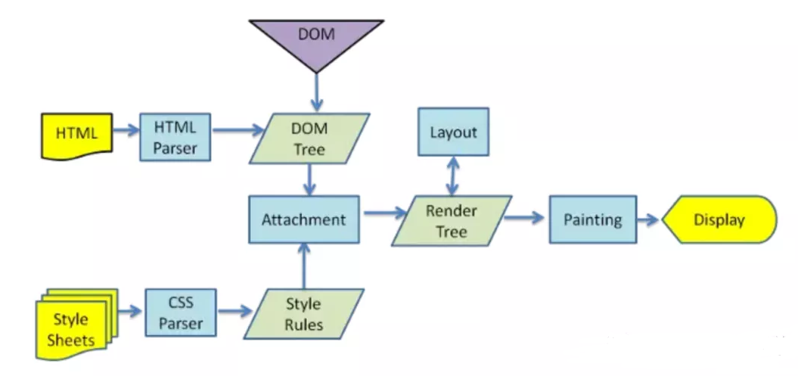
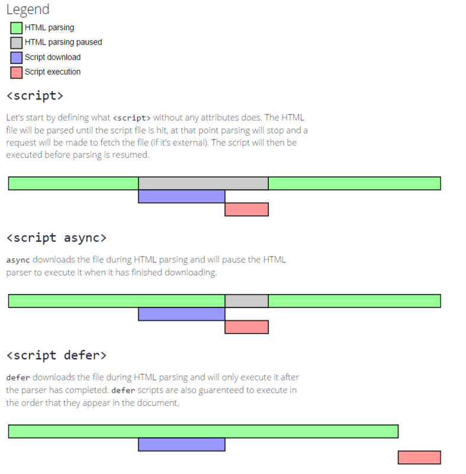

# 页面渲染{#title}

---

### 渲染过程{#rendering-process}

- 解析 HTML：

  浏览器首先会将 HTML 代码解析成 DOM 树，DOM 树是由一系列节点和对象组成的树形结构，表示网页的内容和结构。

- 样式计算：

  浏览器会解析 CSS 样式表，计算每个元素的样式，生成样式规则树和样式计算树。

- 布局计算：

  浏览器会根据 DOM 树和样式计算树计算出每个元素在页面中的位置和大小，生成布局树。

- 绘制页面：

  浏览器根据布局树和样式计算树生成一系列绘图指令，然后将它们传递给渲染引擎，渲染引擎根据指令将页面渲染到屏幕上。

 

---

### 渲染阻塞{#rendering-blocking}

- CSS 是否会阻塞渲染？

::: details 查看答案

1. CSS 的下载和解析不会阻塞 DOM 解析
2. 渲染树是由 DOM Tree 和 CSSOM Tree 一起合成的，它会阻塞 DOM 渲染
3. CSSOM 构建时，JavaScript 执行将暂停，直至 CSSOM 就绪
   :::

- JS 是否会阻塞渲染？

::: details 查看答案

1. JS 的下载和解析可能会阻塞 DOM 解析，取决于 JS 的加载方式
2. JS 的执行会阻塞 DOM 的渲染
   :::

 

---

### JS 的异步加载{#async-load}

- defer

    同步下载，等待文档解析完成才执行，在 DOMContentLoaded 之前

- async

    同步下载，下载完立即执行，顺序不固定

- 三种加载方式的对比

  