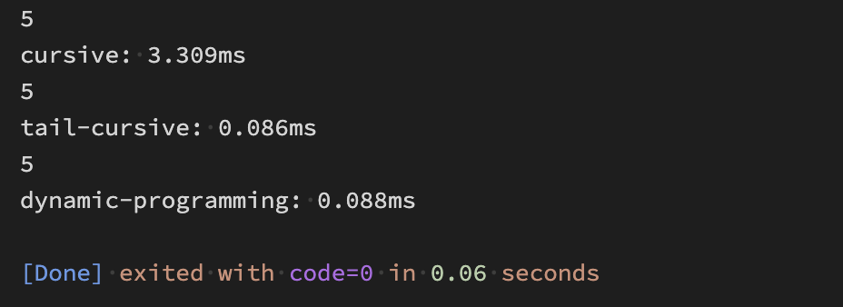
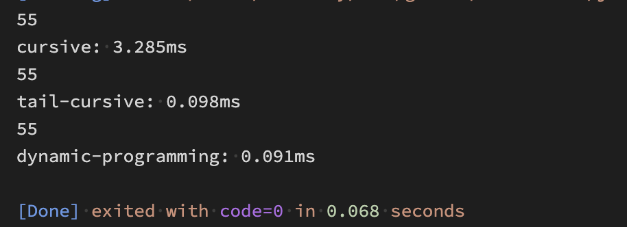

# 斐波那契数列{#title}

---

### 斐波那契数列是什么{#definition}

斐波那契数列（Fibonacci sequence），又称黄金分割数列、因数学家列昂纳多·斐波那契（Leonardoda Fibonacci）以兔子繁殖为例子而引入，故又称为“兔子数列”，指的是这样一个数列：1、1、2、3、5、8、13、21、34...

在数学上，斐波纳契数列以递归的方法定义：

F(0)=0，F(1)=1, F(n)=F(n-1)+F(n-2)（n>=2，n∈N*）

<br />

---

### 斐波那契的实现方式{#methods}

<br />

##### 1. 递归实现{#recursion}

- 通过递归求和时，存在性能瓶颈，有栈溢出风险

::: details 查看代码
```js
function fibonacci(n) {
  if (n <=2) return 1
  return fibonacci(n - 1) + fibonacci(n - 2)
}

console.log(fibonacci(5)) // output ?
```
:::

##### 2. 尾递归实现{#tail-recursion}

::: details 查看代码
```js
function fibonacci(n, s = 0, t = 1) {
  if (n < 2) return t
  return fibonacci(n - 1, t, s + t)
}

console.log(fibonacci(5)) // output ?
```
:::

##### 3. 动态规划实现{#dynamic-programming}

::: details 查看代码
```js
function fibonacci(n) {
  if (n < 2) return 1
  const arr = [0, 1]
  for (let i = 2; i <= n; i++) {
    arr[i] = arr[i - 1] + arr[i - 2]
  }
  return arr[n]
}

console.log(fibonacci(5)) // output ?
```
:::

4. 性能对比

::: info 计算 n = 5 时的结果

:::

::: info 计算 n = 10 时的结果

:::