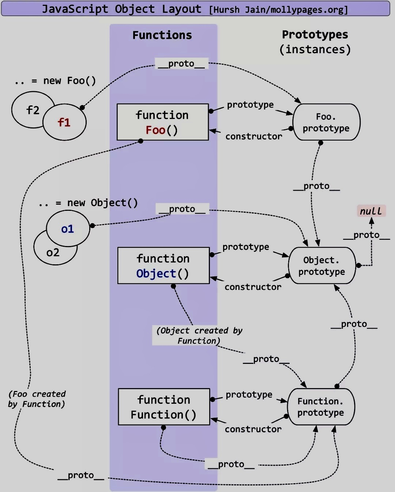

# 原型链{#title}

---

### 原型链的定义{#definition}

访问一个对象的属性时，它不仅仅在该对象上搜寻，还会沿着对象的原型，原型的原型一直往上搜寻，直至匹配到这个属性或者是到达原型链的末尾。

::: details

:::

<br />

---

### 继承{#inheritance}

<br />

#### 1. 原型链继承{#inheritance-1}

- 子类继承父类的原型方法
- 子实例初始化时不能传参
- 父类引用类型的属性会被子实例共享，多个子实例修改该属性时会相互影响

::: details 代码实现
<<< @/snippets/javascript/inheritance-demo-1.js
:::

<br />

#### 2. 盗用构造函数继承{#inheritance-2}

- 子类不继承父类的原型方法
- 子实例初始化时可以传参
- 父类引用类型的属性不被子实例共享

::: details 代码实现
<<< @/snippets/javascript/inheritance-demo-2.js
:::

<br />

#### 3. 组合继承{#inheritance-3}

- 子类继承父类的原型方法
- 子实例初始化时可以传参
- 父类引用类型的属性不被子实例共享
- 父类构造函数会被初始化两次

::: details 代码实现
<<< @/snippets/javascript/inheritance-demo-3.js
:::

<br />

#### 4. 原型式继承{#inheritance-4}

- 创建一个空的构造函数
- 将构造函数的原型指向需要被继承的对象
- 返回这个构造函数的实例
- 效果同原型式继承

::: details 代码实现
<<< @/snippets/javascript/inheritance-demo-4.js
:::

<br />

#### 5. 寄生式继承{#inheritance-5}

- 使用原型继承复制目标对象
- 增强复制对象
- 返回复制对象

::: details 代码实现
<<< @/snippets/javascript/inheritance-demo-5.js
:::

<br />

#### 6. 寄生组合继承{#inheritance-6}

- 子类通过构造函数继承父类
- 修正子类和父类的继承关系
- 修正子类的构造函数指向

::: details 代码实现
<<< @/snippets/javascript/inheritance-demo-6.js
:::

<br />

#### 7. class 继承{#inheritance-7}

- 先将父类实例对象的属性和方法添加到 <code>this</code> 上(调用 <code>super()</code> 方法)
- 用子类的构造函数修改 <code>this</code>

::: details 代码实现
<<< @/snippets/javascript/inheritance-demo-7.js
:::

---

###### 代码示例 ①{#example-1}

- 下述代码分别打印什么内容

```js
function Foo() {
  getName = function () {
    return 1;
  };
  return this;
}
Foo.getName = function () {
  return 2;
};
Foo.prototype.getName = function () {
  return 3;
};
var getName = function () {
  return 4;
};
function getName() {
  return 5;
}

console.log(Foo.getName());
console.log(getName());
console.log(Foo().getName());
console.log(getName());
console.log(new Foo.getName());
console.log(new Foo().getName());
console.log(new new Foo().getName());
```

::: details
<<< @/snippets/javascript/prototype-chain-demo-1.js
:::
